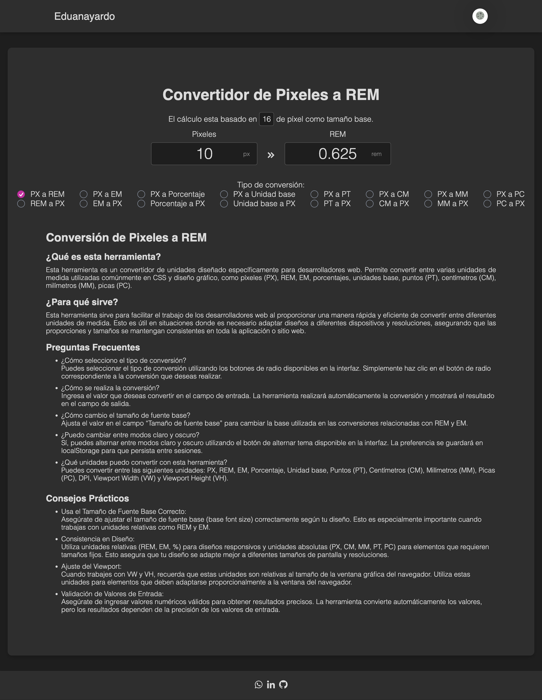

# Conversor de unidades (PX, Rem, Em, Porcentaje, Unidad base)

Esta herramienta permite convertir entre diferentes unidades utilizadas en diseño web, como PX, REM, EM, Porcentaje, Unidades base, Puntos, Centímetros, Molímetros y Picas. La interfaz está diseñada para ser intuitiva y fácil de usar, con soporte para modos claro y oscuro.

## Funcionalidades

- **Convertidor de PX a REM y viceversa**
- **Convertidor de PX a EM y viceversa**
- **Convertidor de PX a Porcentaje y viceversa**
- **Convertidor de PX a Unidad base y viceversa**
- **Convertidor de PX a Puntos y viceversa**
- **Convertidor de PX a Centímetros y viceversa**
- **Convertidor de PX a Milímetros y viceversa**
- **Convertidor de PX a Picas y viceversa**

## Cómo usar

1. Selecciona el tipo de conversión usando los botones de radio.
2. Ingresa el valor en el campo de entrada.
3. La conversión se realizará automáticamente y se mostrará en el campo de salida.
4. Para cambiar el tamaño de fuente base, ajusta el valor en el campo "Tamaño de fuente base".

## Estructura del Proyecto

- **index.html**: Contiene la estructura HTML de la página.
- **style.css**: Contiene los estilos CSS para la página, incluyendo modos claro y oscuro.
- **index.ts**: Archivo principal de TypeScript que maneja la lógica de la conversión y el tema.
- **components/RadioComponent.ts**: Componente de radio utilizado para seleccionar el tipo de conversión.

## Interfaz

### Modo Oscuro


### Modo Claro


## Requisitos

- [Node.js](https://nodejs.org/en)
- [npm (Node Package Manager)](https://www.npmjs.com/)


## Instalación

1. Clona el repositorio:
   ```bash
   git clone https://github.com/eduanayardo/px_rem-converter.git
   ```
2. Navega al directorio del proyecto:
   ```bash
   cd px_rem-converter
   ```

3. Instala las dependencias:
   ```bash
   npm install
   ```

## Compilación

Para compilar el proyecto de TypeScript a JavaScript, ejecuta:
```bash
npx tsc
```

Esto generará los archivos compilados en el directorio `dist` y en mi caso requerí colocar la extension `.js` al importar el `RadioComponent` en el archivo `index.js`.


## Ver Conversor

Abre `src/index.html` en tu navegador.


## Extra

### Meta Tags
El archivo `index.html` contiene las etiquetas meta necesarias para la optimización en motores de búsqueda (SEO) y soporte multilingüe.

### Archivo robots.txt y sitemap.xml
- **robots.txt**: Ubicado en la raíz del proyecto, proporciona directivas para los rastreadores web.
- **sitemap.xml**: Ubicado en la raíz del proyecto, proporciona un mapa del sitio para mejorar la indexación en motores de búsqueda.

## Contribuir

Si deseas contribuir a este proyecto, por favor, sigue estos pasos:

1. Haz un fork del repositorio.
2. Crea una rama para tu nueva función (`git checkout -b feature/nueva-funcion`).
3. Realiza tus cambios y haz commit (`git commit -am 'Añadir nueva función'`).
4. Sube la rama (`git push origin feature/nueva-funcion`).
5. Crea un nuevo Pull Request.

## Licencia

Este proyecto está bajo la licencia MIT. Consulta el archivo [LICENSE](LICENSE) para más detalles.
